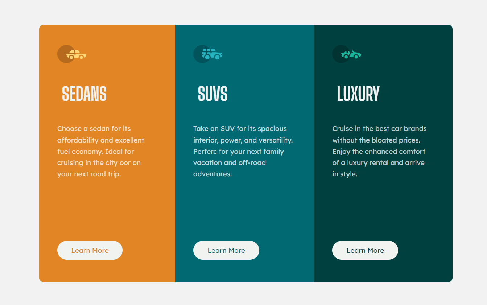

# 3 Column Preview Card Component

This is an HTML and CSS project that showcases three different types of cars: Sedans, SUVs, and Luxury cars. It provides a brief description and a "Learn More" button for each category.

## Preview

## Technologies Used
 - HTML
 - CSS

## Usage
[Click here](https://kgogina.github.io/3-column-preview-card-component/) to open the file in a browser.

## Credits
This project was created as part of a challenge on www.frontendmentor.io. Special thanks to Frontend Mentor for providing the design and inspiration for this project.

Thank you for checking the 3 Column Preview Card Component! If you have any questions or suggestions, please feel free to contact me.
